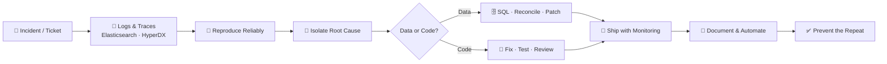

<!-- ═══════════════════════════ HEADER ═══════════════════════════ -->


<p align="center">
  <a href="https://rohit-yadav-portfolio-theta.vercel.app/">
    
  </a>
</p>

<p align="center">
  
  
  
  
</p>

<p align="center">
  <a href="https://rohit-yadav-portfolio-theta.vercel.app/"></a>
  <a href="https://drive.google.com/file/d/1WFPbn1SD9ELcMFWPiHDBGJZIhRQnSbLT/view"></a>
  <a href="https://www.linkedin.com/in/rohit-yadav-bca2026/"></a>
  <a href="mailto:ryadavrohit26@gmail.com"></a>
  <a href="https://github.com/yadav-rohit26"></a>
</p>


<!-- ═══════════════════════════ WHOAMI ═══════════════════════════ -->
<h2 align="center">🧠 &nbsp;<code>$ whoami</code></h2>

```java
package com.rohit.engineering;

public class RohitYadav implements Engineer, LifelongLearner {

    private static final String ROLE     = "Technical Delivery Engineer @ Increff";
    private static final String STUDY    = "MCA @ IIT Patna";
    private static final String DOMAIN   = "Retail & Supply-Chain SaaS";
    private static final String LOCATION = "Bangalore, India";

    private final String[] coreStack    = { "Java", "Spring Boot", "PostgreSQL", "SQL", "REST APIs" };
    private final String[] observability = { "Elasticsearch", "Grafana", "HyperDX", "Postman" };
    private final String[] learningNow  = { "Spring AI", "Microservices", "System Design", "DSA", "Docker" };

    @Override
    public void solve(Problem p) {
        readTheLogs(p);            // never guess — know where to look
        askTheDataRightQuestion(p);// a good query beats an afternoon of theory
        findRootCause(p);          // symptoms lie, traces don't
        shipFix(p).withTests();    // no fix ships untested
        automate(p);               // if a human babysits it, it isn't finished
    }

    public String philosophy() {
        return "Reliable, debuggable, and honest about its own state.";
    }
}
```


<!-- ═══════════════════════════ IMPACT ═══════════════════════════ -->
<h2 align="center">📈 &nbsp;Production, By The Numbers</h2>

<table align="center" width="100%">
<tr>
<td width="25%" align="center"><h2>120K+</h2><b>Orders reconciled daily</b><br/><sub>across all clients</sub></td>
<td width="25%" align="center"><h2>20%</h2><b>Warehouse ops time saved</b><br/><sub>via semi-automation</sub></td>
<td width="25%" align="center"><h2>2</h2><b>Marketplaces bridged</b><br/><sub>Flipkart · Myntra</sub></td>
<td width="25%" align="center"><h2>Prod</h2><b>Systems owned end-to-end</b><br/><sub>setup → go-live</sub></td>
</tr>
</table>


<!-- ═══════════════════════════ MINDSET ═══════════════════════════ -->
<h2 align="center">⚡ &nbsp;How I Work</h2>

<table align="center" width="100%">
<tr>
<td width="25%" align="center">
  <h3>📜</h3>
  <b>Read The Logs First</b><br/>
  <sub>The fastest fix starts with knowing exactly where to look — not guessing.</sub>
</td>
<td width="25%" align="center">
  <h3>🗄️</h3>
  <b>Ask The Data Right</b><br/>
  <sub>A well-shaped SQL query beats an afternoon of speculation.</sub>
</td>
<td width="25%" align="center">
  <h3>🚀</h3>
  <b>Own It To Go-Live</b><br/>
  <sub>Setup, configuration, and the messy production issues after — the whole arc.</sub>
</td>
<td width="25%" align="center">
  <h3>⚙️</h3>
  <b>Automate The Toil</b><br/>
  <sub>If a person has to babysit it, it isn't finished yet.</sub>
</td>
</tr>
</table>


<!-- ═══════════════════════════ PROJECTS ═══════════════════════════ -->
<h2 align="center">🚀 &nbsp;Selected Work</h2>

<table align="center" width="100%">
<tr>
<td width="50%" valign="top">

### 📦 Increff Return Genie
`2025` · `At Increff`

A reconciliation platform that reconciles **120,000+ marketplace returns** against warehouse reality — every single day.

`Node.js` `Express.js` `React` `PostgreSQL` `SQL` `REST APIs`

<a href="https://rohit-yadav-portfolio-theta.vercel.app/projects/return-genie"></a>

</td>
<td width="50%" valign="top">

### 🌦️ Weather ETL Pipeline
`2024` · `Independent`

An automated, containerized ETL pipeline turning raw weather APIs into analytics-ready data.

`Python` `PostgreSQL` `Airflow` `Docker` `Astro` `Power BI`

<a href="https://rohit-yadav-portfolio-theta.vercel.app/projects/etl-airflow"></a>

</td>
</tr>
</table>

<p align="center">
  <a href="https://rohit-yadav-portfolio-theta.vercel.app/#projects"></a>
</p>


<!-- ═══════════════════════════ THE STACK, READ UPWARD ═══════════════════════════ -->
<h2 align="center">☕ &nbsp;The Java Stack, Read From The Ground Up</h2>

<p align="center"><i>Backend engineering isn't a pile of logos — it's a stack where each layer earns the one above it.</i></p>

```text
┌─────────────────────────────────────────────────────────────────┐
│  L4  ARCHITECTURE & DELIVERY   REST APIs · Microservices        │
├─────────────────────────────────────────────────────────────────┤
│  L3  SPRING FRAMEWORK          Boot · MVC · REST · Data JPA     │
├─────────────────────────────────────────────────────────────────┤
│  L2  BUILD & RUNTIME           Maven · Docker                   │
├─────────────────────────────────────────────────────────────────┤
│  L1  LANGUAGE FOUNDATIONS      Core Java · OOP · Collections    │
│                                Exceptions · Threads · JDBC      │
└─────────────────────────────────────────────────────────────────┘
      Spring Boot is only as strong as the Core Java beneath it.
```


<!-- ═══════════════════════════ TECH STACK ═══════════════════════════ -->
<h2 align="center">💻 &nbsp;Tech Arsenal</h2>

<p align="center"><b>⌨️ &nbsp;Languages & Backend</b></p>
<p align="center">
  
  
  
  
  
  
  
  
  
</p>

<p align="center"><b>🗄️ &nbsp;Databases & Data</b></p>
<p align="center">
  
  
  
  
  
  
  
  
  
</p>

<p align="center"><b>🔍 &nbsp;Observability & Debugging</b> <sub><i>— where I actually live</i></sub></p>
<p align="center">
  
  
  
  
  
</p>

<p align="center"><b>☁️ &nbsp;Cloud, DevOps & Tooling</b></p>
<p align="center">
  
  
  
  
  
  
  
  
  
  
</p>


<!-- ═══════════════════════════ RCA FLOW ═══════════════════════════ -->
<h2 align="center">🔄 &nbsp;How I Approach a Production Issue</h2>




<!-- ═══════════════════════════ STATS ═══════════════════════════ -->
<h2 align="center">📊 &nbsp;GitHub Analytics</h2>

<p align="center">
  
  
</p>

<p align="center">
  
</p>

<h3 align="center">📟 &nbsp;Live Metrics Dashboard</h3>

<p align="center">
  
</p>


<!-- ═══════════════════════════ PRINCIPLES ═══════════════════════════ -->
<h2 align="center">✍️ &nbsp;<code>$ cat principles.txt</code></h2>

<table align="center" width="100%">
<tr><td align="center">

> *"Programs must be written for people to read, and only incidentally for machines to execute."*
> **— Harold Abelson, SICP**

> *"Simplicity is prerequisite for reliability."*
> **— Edsger W. Dijkstra**

> *"Production is the real teacher. The fastest path to a fix is rarely the code — it's knowing exactly where to look in the logs."*
> **— me, after enough 2 a.m. incidents**

</td></tr>
</table>


<!-- ═══════════════════════════ CONNECT ═══════════════════════════ -->
<h2 align="center">🤝 &nbsp;<code>$ ./connect.sh</code></h2>

<p align="center">
  Open to <b>backend and Java engineering roles</b> — and always happy to talk about<br/>
  production systems, debugging war stories, or where AI fits into a well-built backend.
</p>

<p align="center">
  <a href="https://rohit-yadav-portfolio-theta.vercel.app/"></a>
  <a href="https://drive.google.com/file/d/1WFPbn1SD9ELcMFWPiHDBGJZIhRQnSbLT/view"></a>
  <a href="https://www.linkedin.com/in/rohit-yadav-bca2026/"></a>
  <a href="mailto:ryadavrohit26@gmail.com"></a>
</p>

<p align="center"><sub>📍 Bangalore, India</sub></p>

<br/>


<p align="center"><sub>⭐ From <a href="https://github.com/yadav-rohit26">yadav-rohit26</a> — built with curiosity, coffee, and a lot of log files.</sub></p>
